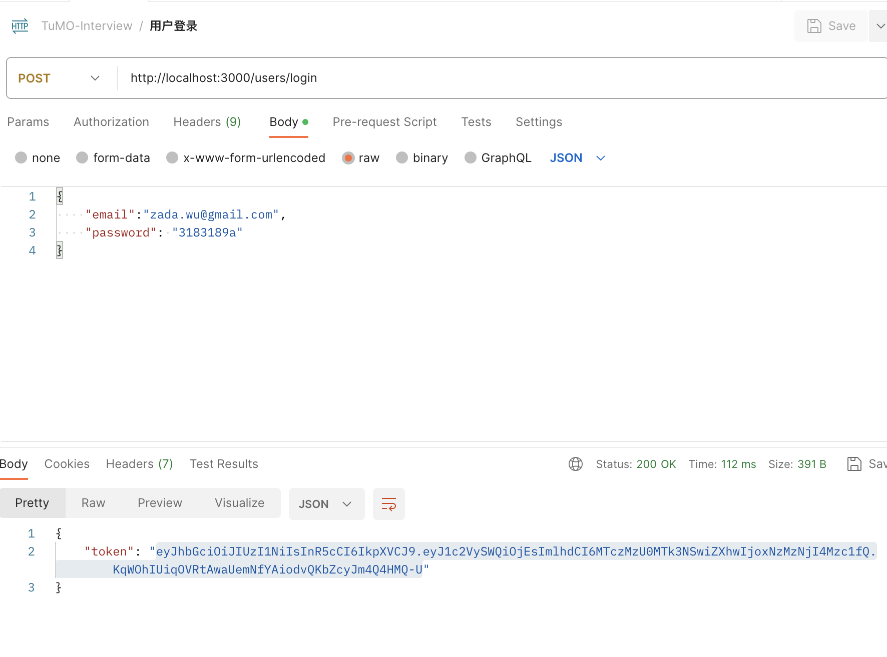
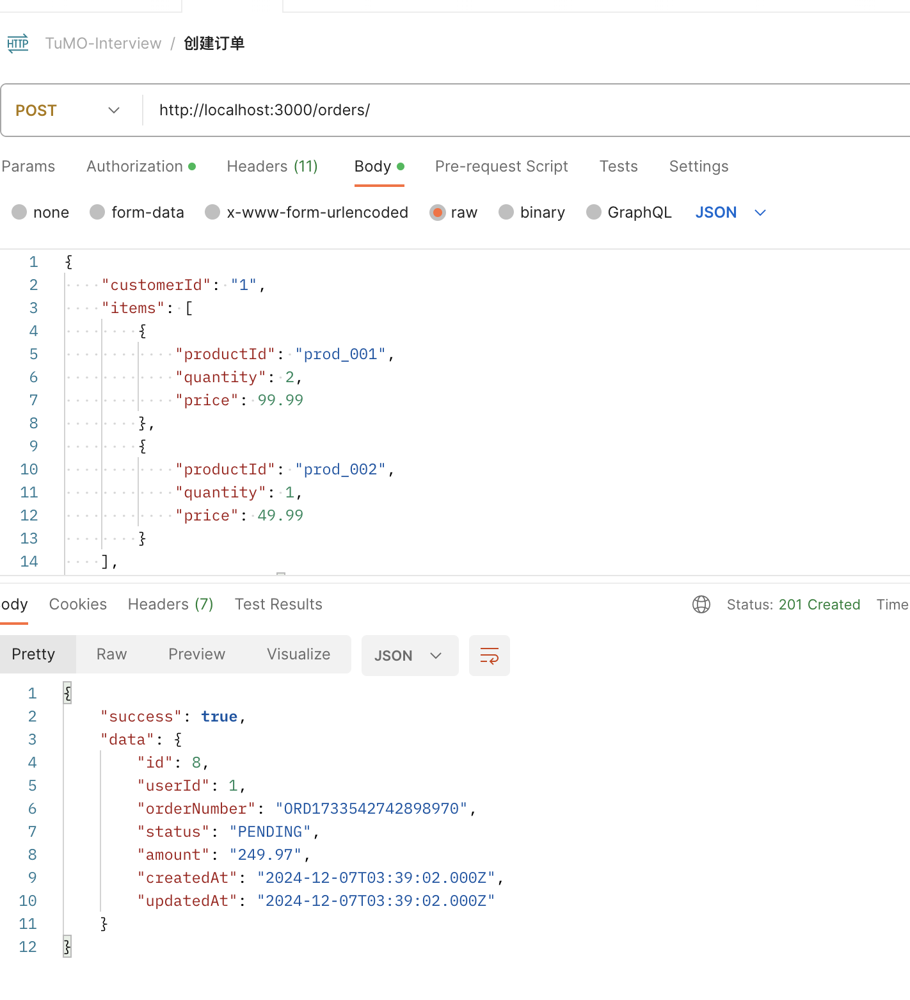
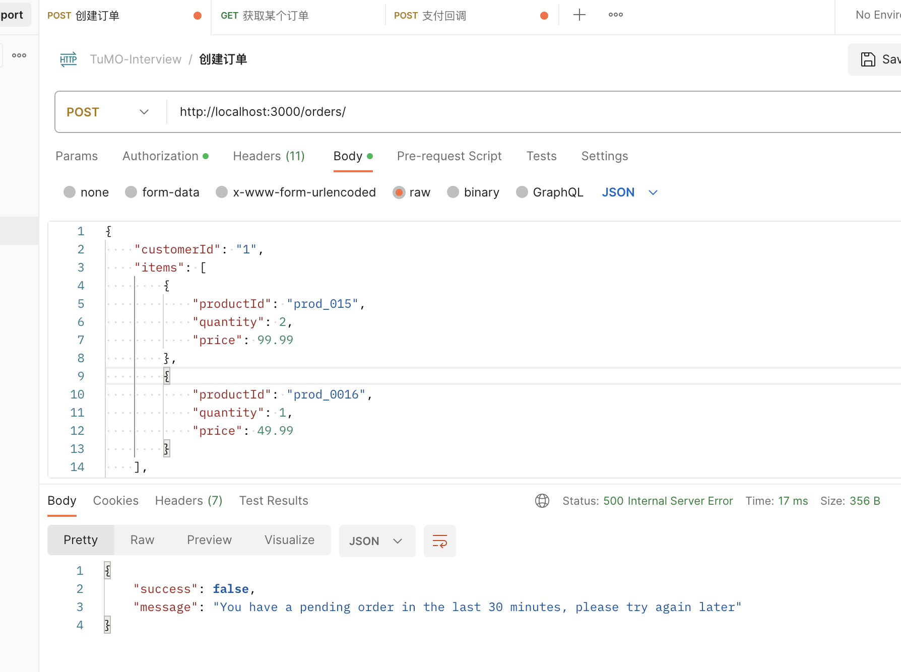
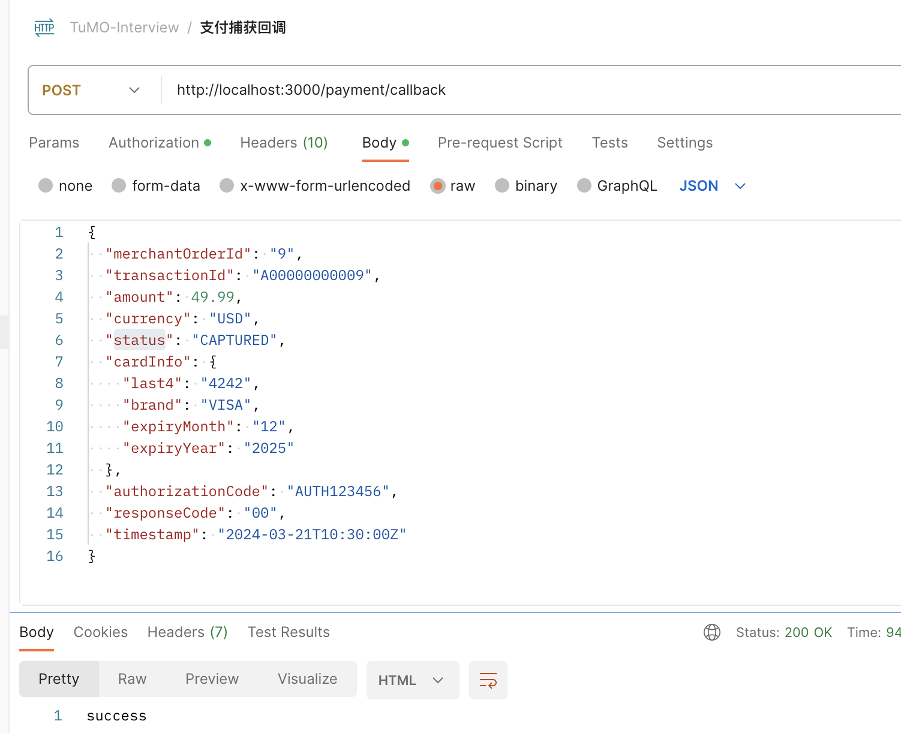

# my-express-app/my-express-app/README.md

# My Express App

这是一个使用 Express 框架构建的 Node.js 应用程序示例。

## 项目结构

```
my-express-app
├── src
│   ├── app.js               # 应用程序入口点
│   ├── controllers          # 控制器目录
│   │   └── index.js         # 控制器实现
│   ├── routes               # 路由目录
│   │   └── index.js         # 路由设置
│   └── models               # 模型目录
│       └── index.js         # 数据模型实现
├── package.json             # npm 配置文件
├── .gitignore               # 版本控制忽略文件
└── README.md                # 项目文档
```

## 安装依赖

在项目根目录下运行以下命令以安装依赖：

```
npm install
```

## 启动应用

使用以下命令启动应用程序：

```
npm start
```

## 数据库
-- 创建用户表
CREATE TABLE IF NOT EXISTS user (
    id INT AUTO_INCREMENT PRIMARY KEY,
    username VARCHAR(255) NOT NULL UNIQUE,
    password VARCHAR(255) NOT NULL,
    email VARCHAR(255) NOT NULL UNIQUE, 
    created_at TIMESTAMP DEFAULT CURRENT_TIMESTAMP
)

-- 创建订单表
CREATE TABLE orders (
    id INT AUTO_INCREMENT PRIMARY KEY,
    userId INT NOT NULL,
    orderNumber VARCHAR(255) NOT NULL UNIQUE,
    status VARCHAR(50) NOT NULL,
    amount DECIMAL(10,2) NOT NULL,
    createdAt TIMESTAMP DEFAULT CURRENT_TIMESTAMP,
    updatedAt TIMESTAMP DEFAULT CURRENT_TIMESTAMP ON UPDATE CURRENT_TIMESTAMP,
    INDEX idx_user_id (userId),
    INDEX idx_order_number (orderNumber)
);

ALTER TABLE orders MODIFY COLUMN status ENUM(
    'PENDING',           -- 待支付
    'PAID',             -- 已支付
    'PROCESSING',       -- 处理中
    'SHIPPED',          -- 已发货
    'DELIVERED',        -- 已送达
    'COMPLETED',        -- 已完成
    'CANCELLED',        -- 已取消
    'REFUND_PENDING',   -- 退款申请中
    'REFUNDED',         -- 已退款
    'CLOSED'            -- 已关闭
) NOT NULL DEFAULT 'PENDING';

-- 创建订单项表
CREATE TABLE order_items (
    id INT AUTO_INCREMENT PRIMARY KEY,
    orderId INT NOT NULL,
    productId VARCHAR(255) NOT NULL,
    quantity INT NOT NULL,
    price DECIMAL(10,2) NOT NULL,
    createdAt TIMESTAMP DEFAULT CURRENT_TIMESTAMP,
    updatedAt TIMESTAMP DEFAULT CURRENT_TIMESTAMP ON UPDATE CURRENT_TIMESTAMP,
    FOREIGN KEY (orderId) REFERENCES orders(id),
    INDEX idx_order_id (orderId)
);

-- 创建订单状态历史表
CREATE TABLE order_status_history (
    id INT AUTO_INCREMENT PRIMARY KEY,
    orderId INT NOT NULL,
    fromStatus VARCHAR(50) NOT NULL,
    toStatus VARCHAR(50) NOT NULL,
    changedBy INT NOT NULL,
    createdAt TIMESTAMP DEFAULT CURRENT_TIMESTAMP,
    FOREIGN KEY (orderId) REFERENCES orders(id),
    INDEX idx_order_id (orderId)
);

-- 创建支付授权表
CREATE TABLE payment_transactions (
    id SERIAL PRIMARY KEY,
    order_id VARCHAR(255) NOT NULL,           -- 商户订单号
    transaction_id VARCHAR(255) NOT NULL,      -- 支付网关交易号
    status VARCHAR(50) NOT NULL,              -- 支付状态：AUTHORIZED/CAPTURED/FAILED/REFUNDED/DISPUTED
    amount DECIMAL(10,2),                     -- 交易金额
    currency VARCHAR(3),                      -- 货币类型
    
    -- 卡信息
    card_last4 VARCHAR(4),                    -- 卡号后四位
    card_brand VARCHAR(50),                   -- 卡品牌
    
    -- 授权/支付信息
    authorization_code VARCHAR(255),           -- 授权码
    captured_amount DECIMAL(10,2),            -- 已捕获金额
    captured_at TIMESTAMP,                    -- 捕获时间
    
    -- 失败信息
    failure_reason TEXT,                      -- 失败原因
    response_code VARCHAR(50),                -- 响应码
    
    created_at TIMESTAMP DEFAULT CURRENT_TIMESTAMP,
    updated_at TIMESTAMP DEFAULT CURRENT_TIMESTAMP,
    
    UNIQUE(transaction_id)
);

## 技术实现
1. 使用JWT来完成身份验证，
2. 使用redis来完成和持久化
3. 使用memcache和redis来完成多层缓存
4. 使用redislock 与 order查询 来避免相同订单重复创建

## 功能点：
1. 用户注册与登录

2. 订单创建(避免相同订单重复创建)


3. 支付授权(避免相同支付回调通知)



## 贡献

欢迎提出问题和贡献代码！